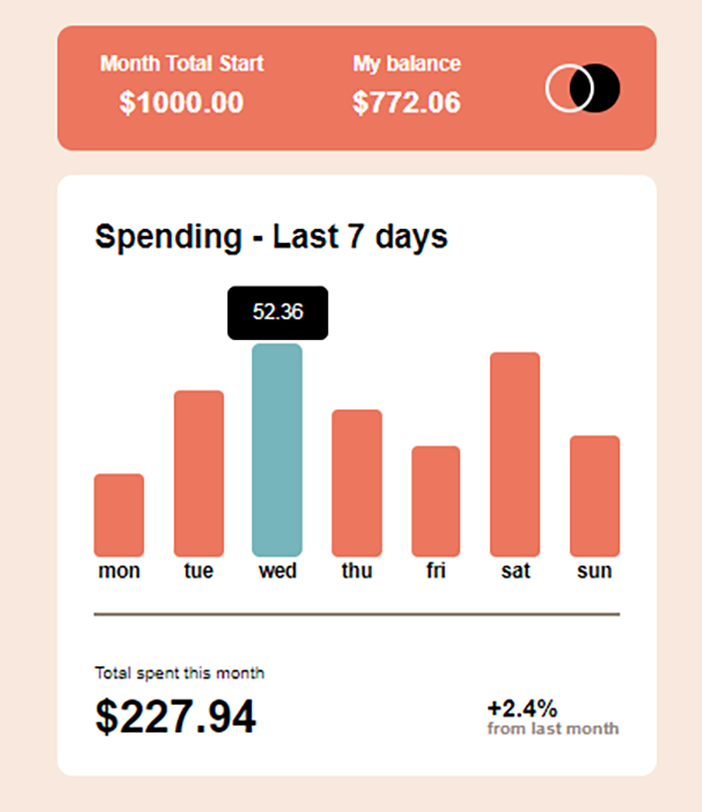

# Frontend Mentor - Expenses chart component


## Welcome! 👋

Thanks for checking out this front-end coding challenge.

[Frontend Mentor](https://www.frontendmentor.io) challenges help you improve your coding skills by building realistic projects.

**To do this challenge, you need a decent understanding of HTML, CSS and JavaScript.**

## The challenge

# Frontend Mentor - Expenses chart component solution

This is a solution to the [Expenses chart component challenge on Frontend Mentor](https://www.frontendmentor.io/challenges/expenses-chart-component-e7yJBUdjwt). Frontend Mentor challenges help you improve your coding skills by building realistic projects. 

## Table of contents
## Table of contents

- [Overview](#overview)
- [Screenshot](#screenshot)
- [Links](#links)
- [My process](#my-process)
- [Built with](#built-with)
- [What I learned](#what-i-learned)
- [Continued development](#continued-development)
- [Useful resources](#useful-resources)
- [Author](#author)
- [Acknowledgments](#acknowledgments)

**Note: Delete this note and update the table of contents based on what sections you keep.**

## Overview

### Screenshot



### Links

- Solution URL: (https://github.com/Junbol-Frontend-Mentor/news-homepage)
- Live Site URL: (https://junbol-frontend-mentor.github.io/news-homepage/)

## My process

### 🛠 Built with

- Semantic HTML5 markup 🧾
- Sass(SCSS) Flexbox 🎨
- BEM (Block.Element.Modifier)🧾
- Mobile-first workflow 📱
- GIT/GitHub 🧾🌎
- PowerShell (CLI) 🧾
- Javascript 🤖🚀

### What I learned

## HTML:

- Remember to add the tabindex="0" attribute to use :focus on css <div class="bar barMon" tabindex="0"></div>.

## css:

```
 &:hover .amount,
  &:focus-within .amount {//🚩this was the solution (-within) so the amount stay in focus after click
    opacity: 1; /* Show amount on bar hover or focus */
  }

    &:hover,
  &:focus {//🚩 There was a 🐞 here: The bar was not staying in focus: Solution: added tabindex="0" attribute in the html code.
    border-radius: 5px;
    background-color: color('cyan');
  }

```

## JAVASCRIPT:

I took the liberty to modify the data.json file to end up with a more efficient app. All was done dynamically.

```
  const maxAmount = expenses.reduce((max, item) => item.amount > max ? item.amount : max, 0);//🚩When you omit the curly braces, the arrow function has an implicit return, meaning it automatically returns the result of the expression without needing the return keyword.
  //max = accumulator item= currentValue

const totalAmountSpent = expenses.reduce((accumulator, item) => accumulator + item.amount, 0); // 0 is the initial value


const barGrpElement = barElement.parentElement;//🚩the se of parentElement was the 🗝️ here

```

### Continued development

I would like to continue studying responsive SCSS specially with Grid + Flexbox and CSS animation, transitions and FX like parallax.

### Useful resources

- [web.dev](https://web.dev/learn/css) - This helped me for get back on track with CSS.
- [w3schools](https://www.w3schools.com/css/default.asp) - The one place to refresh stuff in practical way.

## Author

- Website - [Junier Bolivar](https://www.bolivarcreativedesign.com)
- Frontend Mentor - [Junbol](https://www.frontendmentor.io/profile/Junbol)
- Twitter - [@JunierBolivar](https://www.twitter.com/@JunierBolivar)

## Acknowledgments
